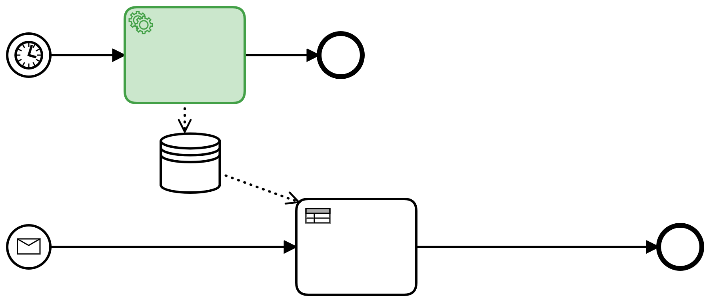

# bpmn.ai: Process Patterns to Orchestrate your AI Services in Business Processes

The journey through an AI project often only begins with a successful proof of concept. There is still little consensus regarding the orchestration of AI services. Tool support and methodological discussions often culminate with the provision of machine learning pipelines (e.g. through [Kubeflow](https://www.kubeflow.org/)) and web services in the cloud. 
From an architectural perspective, it is straightforward how to make a single machine learning model usable and Cloud providers such as [Azure ML Services](https://azure.microsoft.com/de-de/services/machine-learning/) claim this to be an end-to-end solution to Machine Learning per se. But, how to integrate and combine them into business processes in a meaningful way?

Companies that already use a workflow engine (such as [Camunda](https://camunda.com) have a head start on AI use cases. There are different integration patterns, with their own advantages and disadvantages. The patterns can be easily understood as small BPMN processes. This is an important perspective to meet the demands of fairness and transparency in AI applications.

- [bpmn.ai: Process Patterns to Orchestrate your AI Services in Business Processes](#bpmnai-process-patterns-to-orchestrate-your-ai-services-in-business-processes)
  - [Group 1: Getting started](#group-1-getting-started)
    - [Process data collection - just look, do not touch](#process-data-collection---just-look-do-not-touch)
    - [Serviceless AI - DMN as Minimal AI Runtime Environment](#serviceless-ai---dmn-as-minimal-ai-runtime-environment)
    - [Digital Common Sense - Anomaly Detection on Process Results](#digital-common-sense---anomaly-detection-on-process-results)
  - [Group 2: Intervenability](#group-2-intervenability)
    - [Controllable Degree of Automation](#controllable-degree-of-automation)
    - [Decision Support - AI First](#decision-support---ai-first)
  - [Group 3: Data protection and Compliance](#group-3-data-protection-and-compliance)
    - [GDPR Consent](#gdpr-consent)
    - [Arguing for a decision](#arguing-for-a-decision)
  - [Group 4: Sustainability](#group-4-sustainability)
    - [Drift Detection](#drift-detection)
  - [Group 5: Multi-Model Patterns](#group-5-multi-model-patterns)
    - [Anomaly Decision Safeguard](#anomaly-decision-safeguard)
    - [Ensemble](#ensemble)
    - [Divide and Conquer - Prozess Assignment](#divide-and-conquer---process-assignment)
  - [Fazit](#fazit)

*Convention*: AI components are highlighted in green in the process patterns.

## Group 1: Getting started
### Process data collection - just look, do not touch

The first and simplest pattern contains no AI component, but only a business process with a manual activity, whose call is logged with the relevant metadata and process variables included.

This pattern already contributes to the implementation of an AI strategy: Since it brings a manual activity under process control, it allows you to derive insights from the process engine logs, that are highly useful to guide your AI projects in the future.

* How often is this activity performed?
* How large is its share of the runtime of the overall business process?
* How expensive are which activities?
* Are there systematic correlations between input and output of individual activities? May we hope to automate them?

Not only can you use insights such as these to prioritize automisation efforts, you will also need to rely on them while implementing automated decisions with machine learning approaches: They become part of the *loss function*.

An example of this: In input management an AI classifies incoming business transactions and forwards them to the responsible processes. The machine learning for this will learn on the history of manual classifications and try to classify them in the same way. Every machine learning needs a target key metric, which has to be optimized. The classic approach for classification problems of this kind is to optimize a kind of hit rate of correct to incorrect classifications. Although this works, it systematically wastes savings potential - in the end, the goal is incompletely defined. If we want to try to avoid expensive processes, this goal must become part of the target key metric, because in input management not all misclassifications are equally expensive.

* To wrongly categorize an incoming new customer contract as termination is the biggest possible mistake.
* Classifying a termination as an incoming new customer contract is a pity, but has hardly any economic consequences.
* If the economic consequences of mistakes are difficult to estimate, one can at least try to prefer favorable (or favorably correctable) processes.

The classic approach "maximize hit rate" implies that all errors have the same consequences. This is sufficient for a proof-of-concept, but not for productive, economic use of the AI components. To be able to make these weightings, a process data collection is needed as a basis.

:bulb: Especially external, outsourced tasks deserve this kind of attention.

:warning: Avoid storing personal data in process variables, in order to comply with GDPR goals.

### Serviceless AI - DMN as Minimal AI Runtime Environment

Deep learning is modern and inspires with its possibilities, but it is the current ultimate ratio of machine learning: costly, data-hungry, difficult to understand, non-deterministic and they imply an increase in complexity in IT operations: You will need to maintain a number of fast moving infrastucture technologies, probably both software and GPU-ressources.

However, simplicity, explainability and determinism are obvious design goals - according to Commen Sense and also explicitly on the part of regulators such as the [Recommendations of the German Data Protection Conference (in german)](https://www.datenschutzkonferenz-online.de/media/en/20191106_positionspapier_kuenstliche_intelligenz.pdf) since 2019. For decision automation purposes, that rely on tabular data, there may be a shortcut route.

One way to maximize simplicity would be to use a rule-based or decision-tree based approach instead. Often, their results can be translated into _DMN decision tables_ with little frictional loss. DMN tables are not only traceable, but can also be modified as needed. In addition, there is no need for specific operational infrastructure: Modern worflow engines can execute DMN out of the box. This pattern highly attractive from an architecture point of view and in order to collect low-hanging fruits in terms of business cases - it will not serve as lighthouse project and will probably not win the enthusiasm of data scientists.

:bulb: In principle, this is also possible with more complex machine learning methods (e.g. through the [Anchors](https://github.com/viadee/javaAnchorExplainer) approach to derive rules from ML models). 

:warning: However, more precision will be lost in more complex cases in exchange for transparency and changeability. Also, there is an upper limit on what you can claim to be simple and explainable, be it in neural networks or large DMN tables. 

### Digital Common Sense - Anomaly Detection on Process Results

If the dark processing rate is high, whether with or without AI technologies, a control problem arises: There is a lack of common sense to check the result of the process, such as a calculated tariff or a contract, again and to check it for plausibility. In general, this should not be necessary, but errors always occur and if possible the customer should not be the first in the process to notice an error.

To address this issue, an AI procedure of anomaly detection can be used as one of the last process steps and in individual cases automatically trigger an escalation event - a manual check is requested.

The AI does not make its own technical decision here, but it can stop technical decisions of others (people and systems) if they look "strange". The introduction is therefore easier to argue but may offer fewer savings than optimizations. The keynote of anomaly detection is that an AI model learns what constitutes - or even violates - normality in a business process or its results. This can be based on obvious things like tariffs or costs, but it can also include more factors than would be manageable with manual testing. Optionally, aspects of the course of the process could also become part of the anomaly detection, for example to automatically escalate processes that are particularly long-running or (compared to the learned normality) circulated processes that are particularly frequent.

:warning: Attention: Expect false alarms. This pattern assumes that normality has been established in your process. For some business processes this assumption can be wrong.

* Very new processes with less than a few hundred process instances will not have produced enough data to allow the algorithm an adequate view of what _usually happens_.
* If this amount of data is gathered, the algorithm can point out _unusual_ data points and bring them to attention. This will also regularly happen after software releases, whenever they influece the data flowing through your processes. E.g. if you change your pricing scheme in a software release the first prices generated will likely look _unusual_ to the algorithm, until it is retrained on the new data points and we gathered enough of them, to consider them a part of the new normality.

## Group 2: Intervenability

### Controllable Degree of Automation

The use of process engines is an investment in flexibility - changes can be made in a coordinated manner without the need for complex release processes. In this way, an XOR gateway can be used to control automation levels.

Consider an AI component for a classification decision such as _"Does this insurance claim have to be examined by an expert?"_. Besides the decision itself, the AI component indicates how confident it is with its own decision (Confidence). This is usually given in the value range 0.0 to 1.0, where 1.0 corresponds to a 100% certainty, which is hardly achievable. 
Depending on this confidence value, we branch off to a manual processing or bypass it as needed:

* Minimum confidence = 100% - this would be equivalent to a test or pilot operation. The AI component operates live on the real data, but will in fact never make a decision autonomously because the 100% threshold is never reached. Even human clerks would have a residual uncertainty, but do not quantify it.
* Minimum confidence = ~93.45% - The AI decides if it can do it safely and smuggles standard cases past the clerk because for standard cases high confidence will be possible. The concrete threshold value can be optimized with regard to process and error costs, so that threshold values with several decimal places may be useful.
* Minimum confidence = 90.00% - A manually set value, based on the experience of those responsible for the process. The value is below the above-mentioned optimum. This increases the automation rate, we accept a higher error rate. This could be a useful configuration after a major incident, where the department is simply overwhelmed.
* Minimum confidence = 0.00% - The AI always decides autonomously, even if uncertainties are clear. In general, this is not a reasonable configuration, unless a business process is to be operated without employees (e.g. in a lockdown situation). Objection!

:warning: Note group 1: process data collection - automated decisions should be saved for later review, esp. if they have been overruled by manual decisions.

### Decision Support - AI First

Process design with a focus on Intervenability is the decision support where a machine learning component is always called before a human decision. It then passes on its results (including confidence estimation) as support for the manual decision. This is particularly useful when an additional method of explainable AI (XAI) is used, which can generate so-called local (i.e. case-related) explanations.

:warning: These kinds of systems make, despite their invincibility and the supposed focus on human decision making and ethical consideration necessary. Clerks will have to justify in case of doubt for deviations from the "AI specification". This creates an incentive not to do so, for example in the Austrian AMS decision model. From an ethical point of view, this would make the model degenerate to a fully automatic one (including the quality requirements to be met), as long as it is not organizationally ensured that the human decision will be made independently.

In the best case, a human-machine-four-eyes principle is created that improves the overall level of decision quality and consistency across several decision-makers and thus promotes fairness in the sense of equal treatment.

:warning: For this to succeed, equal treatment in the learning data set is a mandatory prerequisite. Also, the Austrian AMS can serve as a negative example, as it only reflects the prejudices of the labor market.

## Group 3: Data protection and Compliance

### GDPR Consent

According to GPDR Art. 22 (Lawfulness of automated processing) para. 1 there is a right of opposition or consent of individuals may be necessary to process their data for specific purposes - among other reasons for the lawfulness of processing, this should be the normal case.

The application of machine learning models would certainly be considered to be _use_ (in the sense of the GDPR), and the inclusion of one's data in the training data stock would certainly be _use_ too. If a customer objects to this use, a "plan B" in the business process is needed, for which ML Serving tools often do not feel responsible.

:bulb: This can be implemented at the processor orchestration level of the IT architecture in a similar way to how VIP business transactions are handled in service companies, for example.

### Arguing for a decision

In addition to the objection, a subsequent dispute of a decision is conceivable - historical decisions are questioned and, if necessary, revised. This dispute results in the obligation to retroactively reconstruct and correct automated decisions.

The machine learning model historizes the case data including the decision and the ML model version. This information is necessary to repeat and systematically analyze individual decisions subsequently on the model. If a case is questioned, an XAI analysis provides the decision paths that led to the result by repeating this and potentially comparable cases. The individual case is justified and can be discussed and revised if necessary. Wrong decision paths become transparent.

Beyond the expected data logging by a process engine, the following applies: Revised decisions are important characteristics in the data. The data set is corrected and marked as revised and corrected - to understand and minimize errors in the ML model in the future.

:warning: As soon as personal data within the meaning of the GPDR are processed in the ML model, this pattern is mandatory (cf. GDPR Art. 22 Para. 3).

## Group 4: Sustainability

### Drift Detection
Most AI applications do not learn continously (and rightly so). This, however, raises the question: _"How often do I need to train my ML model with new data?"_

Drift (or Concept Drift) is a technical term that describes the fact that data becomes stale after some time. ML models derived from data therefore also become stale: The  knowledge baked into the model and reality drift apart. The following patterns helps to measure this effect.

Clerks are randomly assigned cases here with a certain probability. This non-automation rate is freely selectable, but should generally not be 0%, so that fresh training data is available in the future. An example: A company that has recorded market or customer behavior over a long period of time and used it for ML based marketing automation must fear, that the data from before the corona pandemic is no longer meaningful - the model has experienced a (sudden) concept drift.

In order to notice these drifts in less obvious cases, manual decisions are sporadically required. They create a reference.
Often only parts of the market behavior change - small things like new car brands make it difficult for a machine learning model to generalize rules from the past into the future. A continuous supply of up-to-date, manual decisions helps here as well. 

:bulb: The pattern can also be used as a feature toggle for a pilot, i.e. a riskless rollout, if the degree of automation adjusts close to 0%. 

:warning: It is important to log for each case whether a manual or an automatic decision has been made, in order to ensure auditability and to prevent the model from following its own unverified decisions in later training rounds.

## Group 5: Multi-Model Patterns

### Anomaly Decision Safeguard

Machine learning models make wrong decisions, just like humans do. Sometimes seemingly random effects put an upper bound to predictions - customer churn can be reasonably estimated, but never really predicted for individual customers. Low training data for rare or special cases are often responsible for estimations that turn out to be wrong later. 

By combining two ML procedures we mitigate this risk by identifying rarities - anomalies - and steering them to the person in charge. It is safe to assume, that a machine learning model will not perform on these cases anyway, since individual cases can be strange in all kinds of ways. The underlying reasoning of analogy as referring to similar cases from the past is likely to break down when there are no reasonably similar cases. This leads to the following pattern:

An _anomaly detection_ evaluates each case first with an anomaly score. For example in an insurance claims process, the first car damage reported for a new electric car model should of course be evaluated manually as well as for example unusually costly repairs on sports cars are. 

* Low anomaly scores should be the rule. These routines are sufficiently present in the training data and the Ml model can decide cases with high confidence.  
* Medium anomaly scores are rare. Process owners control a threshold value equivalent to the confidence. If this threshold exceeds, it is an anomaly that requires human attention. In this way, useful training data is generated.
* High anomaly scores - anomalies - are always taken over by manual processing. Here there is little hope for automation in the long run, but the attention is well invested. 

Anomaly Detection addresses the risk of "slipping" unknown cases through automation. Although an ML-based classification should evaluate anomalies with low confidence, anomaly scores and confidence values are different use cases.

Anomalies could identify special cases that may offer opportunities for process improvement. Controlling anomalies generate new learning data in a targeted manner, which will help future models learn to deal with these cases more safely.

:bulb: Machine learning models that are accessible by third parties may also have to protect themselves against targeted attacks that intend to mislead a model (Adversarial Machine Learning). The structure is identical.

### Ensemble

Different methods of machine learning also have different strengths and weaknesses. Here are two examples:

* Decision trees, for example, are easy to understand - the overfitting problem is easy to master, but complex relationships in the respective domain remain unnoticed.
* Deep learning is difficult to understand but learns relationships in deeper complexity.

The ensemble idea is to combine the strengths of several methods: Several models decide the same case - if there is an agreement, the decision is clear. Disagreement is observed and also monitored with machine learning tools - another model decides which models perform well in which situations. 

Alternatively, decisions can also be made democratically, if necessary with human participation in the sense of a 4-eye principle. Often ensembles are also used "packaged", i.e. in such a way that they act as a single model from the calling architectural layer. A disadvantage is that the strengths and weaknesses of the partial models remain invisible to the outside and thus also non-reflectable. Explicit modeling also makes a step-by-step rollout of new models possible: New "fellow citizens" join the democracy and vote, perhaps giving good confidence values and thus receiving a lot of decision weight - or not.

:warning: Run and learning times increase, feature importance is more difficult to derive. Decision quality increases at the price of the complexity of ML-based decisions.

### Divide and Conquer - Process Assignment

Often it is not just one process that needs to be automated, but several. Often processes can be triggered by business transactions via several input channels. This is where the Divide-and-Conquer principle comes into play with several ML models that solve parts of a problem.

A first processing step extracts from incoming documents, e-mails, or chat messages all entities, i.e. all identifiable aspects, as they might be entered into a form in the processing: Customer names, e-mail addresses, invoice numbers, etc. or more abstract assessments such as a sentiment analysis to identify and quantify affective states and subjective information, especially the expressed mood.

In this way, a stream of rather weakly structured data turns into one with single known fields. These can be used in a second ML step to classify the most suitable subsequent process that can process the data.

The separation of these two steps makes strategic sense because Entity Extraction is becoming a standard product for which pre-trained models or cloud services can be used. Process classification requires separate learning data for their own processes.

:warning: There may be incidents that do not belong in any process or contain multiple concerns.

:warning: The target metric used for machine learning should not only be optimized for the "hit rate" but should also take individual error costs into account. A wrong classification of a contract application as termination can be expensive.

## Summary

Machine Learning supports many challenges of modern process automation. The collection of process key metrics alone improves the data situation and provides information about the behavior of individual sub-processes. Process owners use confidence to control the degree of automation and maintain control over the machine. 

A healthy skepticism about ML integration will give way to justified trust if risks are adequately addressed through explainability, drift detection, and anomaly detection. Regardless of the patterns or the type of ML model used, it is recommended or if personal data is involved required to safe ML decisions. A history of ML results and used models help to argue for both privacy and the quality of automated decisions.
