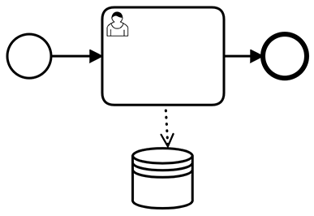

# bpmn.ai: Process Patterns to Orchestrate your AI Services in Business Processes

The journey through an AI project often only begins with a successful proof of concept. There is still little consensus regarding the orchestration of AI services. Tool support and methodological discussions often culminate with the provision of machine learning pipelines (e.g. through [Kubeflow](https://www.kubeflow.org/)) and web services in the cloud. 
From an architectural perspective, it is straightforward how to make a single machine learning model usable. But, how to integrate and combine them into business processes in a meaningful way?

Companies that already use a workflow engine (such as [Camunda](https://camunda.com) have a head start on AI use cases. There are different integration patterns, with their own advantages and disadvantages. The patterns can be easily understood as small BPMN processes. This is an important perspective to meet the demands of fairness and transparency in AI applications.

- [bpmn.ai: Process Patterns to Orchestrate your AI Services in Business Processes](#bpmnai-process-patterns-to-orchestrate-your-ai-services-in-business-processes)
  - [Group 1: Getting started](#group-1-getting-started)
    - [Process data collection - just look, do not touch](#process-data-collection---just-look-do-not-touch)
    - [Serviceless AI - DMN as minimal AI Runtime Environment](#serviceless-ai---dmn-as-minimal-ai-runtime-environment)
    - [Gesunder Maschinenverstand - Anomalie-Erkennung auf Prozess-Ergebnissen](#gesunder-maschinenverstand---anomalie-erkennung-auf-prozess-ergebnissen)
  - [Gruppe 2: Intervenierbarkeit](#gruppe-2-intervenierbarkeit)
    - [Steuerbarer Automatisierungsgrad](#steuerbarer-automatisierungsgrad)
    - [Entscheidungsunterstützung - AI first](#entscheidungsunterstützung---ai-first)
  - [Gruppe 3: Datenschutz](#gruppe-3-datenschutz)
    - [Entscheidung argumentieren](#entscheidung-argumentieren)
  - [Gruppe 4: Nachhaltigkeit](#gruppe-4-nachhaltigkeit)
    - [Drift Detection](#drift-detection)
  - [Gruppe 5: Multi-Model](#gruppe-5-multi-model)
    - [Routine automatisieren - aus Chancen lernen](#routine-automatisieren---aus-chancen-lernen)
    - [Ensemble](#ensemble)
    - [Divide and Conquer - Prozess-Zuordnung](#divide-and-conquer---prozess-zuordnung)
  - [Fazit](#fazit)

*Convention*: AI components are highlighted in green in the process patterns.

## Group 1: Getting started
### Process data collection - just look, do not touch

The first and simplest pattern contains no AI component, but only a business process with a manual activity, whose call is logged with the relevant metadata and process variables included.

This pattern already contributes to the implementation of an AI strategy: Since it brings a manual activity under process control, it allows you to derive insights from the process engine logs, that are highly useful to guide your AI projects in the future.

* How often is this activity performed?
* How large is its share of the runtime of the overall business process?
* How expensive are which activities?
* Are there systematic correlations between input and output of individual activities? May we hope to automate them?

Not only can you use insights such as these to prioritize automisation efforts, you will also need to rely on them while implementing automated decisions with machine learning approaches: They become part of the *loss function*.

An example of this: In input management an AI classifies incoming business transactions and forwards them to the responsible processes. The machine learning for this will learn on the history of manual classifications and try to classify them in the same way. Every machine learning needs a target key metric, which has to be optimized. The classic approach for classification problems of this kind is to optimize a kind of hit rate of correct to incorrect classifications. Although this works, it systematically wastes savings potential - in the end, the goal is incompletely defined. If we want to try to avoid expensive processes, this goal must become part of the target key metric, because in input management not all misclassifications are equally expensive.

* To wrongly categorize an incoming new customer contract as termination is the biggest possible mistake.
* Classifying a termination as an incoming new customer contract is a pity, but has hardly any economic consequences.
* If the economic consequences of mistakes are difficult to estimate, one can at least try to prefer favorable (or favorably correctable) processes.

The classic approach "maximize hit rate" implies that all errors have the same consequences. This is sufficient for a proof-of-concept, but not for productive, economic use of the AI components. To be able to make these weightings, a process data collection is needed as a basis.

:bulb: Especially external, outsourced tasks deserve this kind of attention.

:warning: Avoid storing personal data in process variables, in order to comply with GDPR goals.

### Serviceless AI - DMN as minimal AI Runtime Environment

Deep learning is modern and inspires with its possibilities, but it is the current ultimate ratio of machine learning: costly, data-hungry, difficult to understand, non-deterministic and they imply an increase in complexity in IT operations: You will need to maintain a number of fast moving infrastucture technologies, probably both software and GPU-ressources.

However, simplicity, explainability and determinism are obvious design goals - according to Commen Sense and also explicitly on the part of regulators such as the [Recommendations of the German Data Protection Conference (in german)](https://www.datenschutzkonferenz-online.de/media/en/20191106_positionspapier_kuenstliche_intelligenz.pdf) since 2019. For decision automation purposes, that rely on tabular data, there may be a shortcut route.

One way to maximize simplicity would be to use a rule-based or decision-tree based approach instead. Often, their results can be translated into _DMN decision tables_ with little frictional loss. DMN tables are not only traceable, but can also be modified as needed. In addition, there is no need for specific operational infrastructure: Modern worflow engines can execute DMN out of the box. This pattern highly attractive from an architecture point of view and in order to collect low-hanging fruits in terms of business cases - it will not serve as lighthouse project and will probably not win the enthusiasm of data scientists.

:bulb: In principle, this is also possible with more complex machine learning methods (e.g. with the [Anchors](https://github.com/viadee/javaAnchorExplainer) method). 

:warning: However, more precision will be lost in more complex cases in exchange for transparency and changeability. Also, there is an upper limit on what you can claim to be simple and explainable, be it in neural networks or large DMN tables. 

### common sense - anomaly detection on process results

If the dark processing rate is high, whether with or without AI technologies, a control problem arises: There is a lack of common sense to check the result of the process, such as a calculated tariff or a contract, again and to check it for plausibility. In general, this should not be necessary, but errors always occur and if possible the customer should not be the first in the process to notice an error.

To address this issue, an AI procedure of anomaly detection can be used as one of the last process steps and in individual cases automatically trigger an escalation event - a manual check is requested.

The AI does not make its own technical decision here, but it can stop technical decisions of others (people and systems) if they look "strange". The introduction is therefore easier to argue but may offer fewer savings than optimizations. The keynote of anomaly detection is that an AI model learns what constitutes - or even violates - normality in a business process or its results. This can be based on obvious things like tariffs or costs, but it can also include more factors than would be manageable with manual testing. Optionally, aspects of the course of the process could also become part of the anomaly detection, for example to automatically escalate processes that are particularly long-running or (compared to the learned normality) circulated processes that are particularly frequent.

:warning: Attention: Here it is assumed that normality has been established. For some business processes this assumption can be wrong, e.g. for very new processes or processes that have just changed significantly.

## Gruppe 2: Intervenierbarkeit

### Steuerbarer Automatisierungsgrad

Die Nutzung von Process-Engines ist eine Investition in Flexibilität - Veränderungen werden auch ohne aufwändige Release-Prozesse koordiniert möglich. Auf diese Weise lässt sich ein XOR-Gateway nutzen, um Automatisierungsgrade zu steuern.

Eine KI-Komponente kommt immer als erstes zum Zuge und trifft eine Klassifikations-Entscheidung wie bspw.: “Muss dieser Schadensfall einer Versicherung von einem Sachverständigen geprüft werden?” Neben der Entscheidung selbst, gibt die KI-Komponente an, wie sicher sie mit ihrer eigenen Entscheidung ist (Confidence). Dies wird üblicherweise auf dem Wertebereich 0.0 bis 1.0 angegeben, wobei 1.0 einer 100%-Sicherheit entspricht, die faktisch kaum erreichbar ist. Abhängig von diesem Konfidenzwert verzweigen wir nach Bedarf zur Sachbearbeitung oder umgehen sie:

* Mindestkonfidenz = 100% - das käme einem Test- oder Pilotbetrieb gleich. Die KI-Komponente operiert live auf den Echtdaten, wird aber faktisch nie eine Entscheidung autonom treffen, weil die 100%-Schwelle nie erreicht wird. Auch menschliche Sachbearbeiter:innen hätten eine Rest-Unsicherheit, quantifizieren diese aber nicht.
* Mindestkonfidenz = ~93.45% - Die KI entscheidet, wenn sie es sicher kann und schleust Standardfälle an der Sachbearbeiterin vorbei, denn für Standardfälle wird eine hohe Konfidenz möglich sein. Den konkreten Schwellwert kann man auf Prozess- und Fehlerkosten hin optimieren, sodass ggf. Schwellwerte mit mehreren Nachkommastellen sinnvoll sind.
* Mindestkonfidenz = 90.00% - Ein manuell gesetzter Wert, aus der Erfahrung der Prozessverantwortlichen heraus gesetzt. Der Wert liegt unter dem o.g. Optimum. So wird die Automatisierungsquote erhöht, eine höhere Fehlerquote nehmen wir in Kauf. Das könnte eine sinnvolle Konfiguration nach einem Schaden-Großereignis sein, bei dem die Abteilung schlicht überfordert ist.
* Mindestkonfidenz = 0.00% - Die KI entscheidet immer autonom, auch wenn Unsicherheiten deutlich sind. Im allgemeinen ist das keine sinnvolle Konfiguration, es sei denn es gilt einen Geschäftsprozess pauschal ohne Mitarbeiter:innen zu betreiben (bspw. in einer Lockdown-Situation).
Einspruch!

Nach Art. 22 (Rechtmäßigkeit der Verarbeitung) Abs. 1 der DSGVO gibt es ein Einspruchsrecht, bzw. die Einwilligung von Personen kann notwendig sein, um deren Daten zu bestimmten Zwecken zu verarbeiten - neben anderen Gründen für die Rechtmäßigkeit der Verarbeitung sollte dies der Normalfall sein.

Die Anwendung von Machine-Learning-Modellen wäre sicher eine Nutzung, die Aufnahme in den Trainingsdatenbestand sicher auch. Widerspricht eine Kundin dieser Nutzung, braucht es einen “Plan B” im Geschäftsprozess, für den sich ML-Serving-Tools oft nicht zuständig fühlen.

:bulb: Dies kann in ähnlicher Weise auf dem Prozessorchestrierungs-Level der IT-Architektur umgesetzt werden, wie man bspw. VIP-Geschäftsvorfälle in Dienstleistungsunternehmen handhabt.

### Entscheidungsunterstützung - AI first

Eine Prozess-Konstruktion mit Fokus auf Intervenierbarkeit ist die Entscheidungsunterstützung, bei der eine Machine-Learning-Komponente immer vor einer menschlichen Entscheidung aufgerufen wird. Sie gibt dann ihre Ergebnisse (inkl. Konfidenz-Einschätzung) als Unterstützung zur manuellen Entscheidung weiter. Dies ist besonders sinnvoll, zusätzlich ein Verfahren der erklärbaren KI (XAI) zum Einsatz kommt, dass sog. lokale (also Einzelfall-bezogene) Erklärungen erzeugen kann.

:warning: Systeme dieser Art machen, trotz ihrer Invervenierbarkeit und dem vermeintlichen Fokus auf die menschliche Entscheidung eine ethische Betrachtung notwendig. Sachbearbeiter:innen werden sich im Zweifel für Abweichungen von der “KI-Vorgabe” rechtfertigen müssen. Das schafft einen Anreiz, dies nicht zu tun, wie bspw. beim Österreicher AMS-Entscheidungsmodell. Dies würde das Modell aus ethischer Sicht zu einer Voll-Automatik verkommen lassen (inkl. der dann zu stellenden Qualitäts-Ansprüche), solange nicht organisatorisch sichergestellt ist, dass die menschliche Entscheidung unabhängig gefällt werden wird.

Im besten Fall entsteht so ein Mensch-Maschine-4-Augen-Prinzip, dass das Gesamtniveau an Entscheidungsqualität und Konsistenz über mehrere Entscheidungsträger:innen hinweg verbessert und damit Fairness im Sinne einer Gleichbehandlung fördert.

:warning: Damit dies gelingt, ist Gleichbehandlung im Lerndatensatz die zwingende Voraussetzung. Auch hier kann das Österreicher AMS als negatives Beispiel dienen, da es die Vorurteile des Arbeitsmarktes nur mit abbildet.

## Gruppe 3: Datenschutz

### Entscheidung argumentieren

Neben dem Einspruch ist eine nachträgliche Anfechtung denkbar - historische Entscheidungen werden hinterfragt und ggf. revidiert. Hierdurch ergibt sich die Pflicht automatisierte Entscheidungen nachträglich nachzuvollziehen und korrigieren zu können.

Das Machine-Learning-Modell historisiert die Falldaten inkl. Entscheidung und der ML-Modell Version. Diese Informationen sind notwendig, um einzelne Entscheidungen nachträglich am Modell zu wiederholen und systematisch zu analysieren. Wird ein Fall hinterfragt, dann liefert eine XAI-Analyse durch die Wiederholung dieses und potenziell vergleichbarer Fälle die Entscheidungswege, welche zum Ergebnis geführt haben. Der Einzelfall ist begründet und kann diskutiert und ggf. revidiert werden. Falsche Entscheidungswege werden transparent.

Über die ohnehin zu erwartende Protokollierung durch eine Prozess-Engine hinaus gilt: Revidierte Entscheidungen sind ein wichtiges Merkmal in den Daten. Der Datensatz wird korrigiert und als revidiert und korrigiert gekennzeichnet - um Fehler im ML Modell zu  verstehen und zukünftig zu minimieren.

:warning: Sobald personenbezogene Daten im Sinne der DSGVO im ML-Modell verarbeitet werden, ist dieses Muster verpflichtend (Vgl. Art 22 Abs. 3 DSGVO).

## Gruppe 4: Nachhaltigkeit

### Drift Detection

Drift ist ein Fachbegriff, der beschreibt, dass Daten veralten und dass somit auch die aus Daten abgeleiteten ML-Modelle veralten: Das erlernte Wissen im Modell und die Realität driften auseinander.

Zufällig bekommen hier Sachbearbeiter:innen Fälle zugeordnet. Die Automatisierungsquote ist frei wählbar, sollte aber im Allgemeinen nicht 100% betragen, damit es auch in Zukunft frische Trainingsdaten gibt. Ein Beispiel: Ein Unternehmen, dass Markt- oder Kundenverhalten über lange Zeit aufgezeichnet und für Machine Learning verwendet hat, muss fürchten, dass die Daten von vor der Corona-Zeit keine Aussagekraft mehr für die Zukunft haben - man sagt, das Modell hat eine Concept Drift erfahren.

Um diese in weniger offensichtlichen Fällen zu bemerken werden sporadisch manuelle Entscheidungen benötigt, die mit den KI-Entscheidungen verglichen werden.
Oft ändern sich nur Teile des Marktverhaltens - kleine Dinge wie bspw. neue Automarken machen es einem Machine Learning Model schwer aus der Vergangenheit zu lernen. Auch hier hilft eine kontinuierliche Versorgung mit aktuellen, manuellen Entscheidungen. 

:bulb: Das Muster kann auch für einen Pilotbetrieb / Riskless Rollout verwendet werden, wenn der Automatisierungsgrad nahe 0% justiert. Wichtig ist noch, jeweils zu protokollieren, ob eine manuelle oder automatische Entscheidung getroffen wurde, um Auditierbarkeit sicherzustellen und zu verhindern, dass das Modell sich an eigenen unverifizierten Entscheidungen orientiert.

## Gruppe 5: Multi-Model

### Routine automatisieren - aus Chancen lernen

Machine Learning trifft Fehlentscheidungen, wie Menschen auch. Geringe Trainingsdaten für seltene oder Sonderfälle sind hierfür hauptverantwortlich. Durch Kombination verschiedener ML Verfahren begegnen wir diesem Risiko, indem Seltenheiten - Anomalien - identifiziert und zur Sachbearbeiter:in gesteuert werden.

Eine Anomalieerkennung bewertet jeden Fall zuerst mit einem Anomalie-Score. Beispielsweise sollte der erste KFZ-Schaden eines neuen E-PKW Modells manuell bewertet werden, u.a. um daraus zu lernen.

* Niedrige Anomalie-Scores sollten die Regel darstellen. Diese Routinen sind ausreichend in den Trainingsdaten vorhanden und können mit hoher Konfidenz vom ML-Modell entscheiden werden.  
* Mittlere Anomalie-Scores sind selten. Prozessverantwortliche kontrollieren einen, der Konfidenz äquivalenten, Schwellwert. Wird dieser überschritten handelt es sich um eine Anomalie, die menschliche Aufmerksamkeit benötigt. Auf diese Weise werden nützliche Trainingsdaten erzeugt.
* Hohe Anomalie-Scores - Anomalien - werden grundsätzlich von einer manuellen Sachbearbeitung übernommen. Hier besteht dauerhaft wenig Hoffnung auf Automatisierung, aber die Aufmerksamkeit ist hier auch gut investiert. 

Anomalieerkennung begegnet dem Risiko unbekannte Fälle durch die Automatisierung “rutschen” zu lassen. Zwar sollte eine ML-basierte Klassifizierung Anomalien mit niedriger Konfidenz bewerten, jedoch sind Anomalie-Scores und Konfidenzwerte unterschiedliche Anwendungsfälle.

Anomalien könnte Sonderfälle identifizieren, welche wohlmöglich Chancen auf Prozessverbesserung bieten. Mindestens aber lernen zukünftige Modelle durch das gezielte Erzeugen neuer Lerndaten sicherer mit diesen Fällen umzugehen.

:bulb: Machine Learning-Modelle, die für Dritte zugänglich sind, müssen sich ggf. auch gegen gezielte Angriffe schützen, die ein Modell gezielt in die Irre führen sollen (Adversarial Machine Learning). Der Aufbau hierzu ist identisch.

### Ensemble

Verschiedene Verfahren des Machine-Learning haben auch unterschiedliche Stärken und Schwäche. Zwei Beispiele dazu:

* Entscheidungsbäume sind bspw. einfach nachzuvollziehen - das Overfitting-problem ist gut beherrschbar, komplexe Zusammenhänge in der jeweiligen Domäne bleiben dagegen unbeachtet.
* Deep Learning ist schlecht nachzuvollziehen, lernt allerdings Zusammenhänge in tieferer Komplexität.

Die Ensemble-Idee ist die Stärken von mehreren Verfahren zu kombinieren: Mehrere Modelle entscheiden den gleichen Fall - herrscht Einigkeit ist die Entscheidung klar. Uneinigkeit wird beobachtet und ebenfalls mit Machine-Learning-Mitteln überwacht - ein weiteres Modell entscheidet, welche Modelle in welchen Situationen gute Performance zeigen. 

Alternativ kann hier auch demokratisch entschieden werden, ggf. auch mit menschlicher Beteiligung im Sinne eines 4-Augen-Prinzips. Oft werden Ensembles auch “verpackt” eingesetzt, d.h. so, dass sie aus der aufrufenden Architektur-Schicht als ein einziges Modell agieren. Ein Nachteil ist, dass Stärken und Schwächen der Teil-Modelle nach außen hin unsichtbar und damit auch unreflektierbar bleiben. Mit einer expliziten Modellierung wird auch ein schrittweiser Rollout neuer Modelle möglich: Neue “Mitbürger” kommen mit in die Demokratie und stimmen mit ab, geben vielleicht gute Konfidenzwerte an und bekommen so viel Entscheidungs-Gewicht - oder nicht.

:warning: Lauf- und Lernzeiten steigen an, Feature-Wichtigkeiten sind schwerer abzuleiten.

### Divide and Conquer - Prozess-Zuordnung

Oft gilt es nicht nur einen Prozess zu automatisieren, sondern mehrere. Oft können Prozesse über mehrere Eingangskanäle durch Geschäftsvorfälle ausgelöst werden. Hier greift das Divide-and-Conquer Prinzip mit mehreren ML-Modellen, die Teile einer Problemstellung lösen.

Ein erster Verarbeitungsschritt extrahiert aus den eingehenden Dokumenten, E-Mails oder bspw. Chat-Nachrichten alle Entitäten, d.h. alle identifizierbaren Aspekte, wie sie in der Sachbearbeitung vielleicht in ein Formular eingetragen würden: Kunden-Namen, Mail-Adressen, Rechnungsnummern, etc. oder auch abstraktere Einschätzungen wie bspw. eine Sentiment-Analyse um die ausgedrückte Stimmung zu erfassen.

Auf diese Weise entstehen aus einem Strom eher schwach strukturierter Daten einer mit einzelnen bekannten Feldern. Diese lassen sich in einem zweiten ML-Schritt zur Klassifikation des am besten geeigneten Folgeprozesses nutzen, der die Daten verarbeiten kann.

Die Auftrennung dieser beiden Schritte ist strategisch sinnvoll, denn die Entity Extraction entwickelt sich zu einem Standard-Produkt, für das vortrainierte Modelle oder Cloud-Services eingesetzt werden können. Für die Prozessklassifikation braucht es eigene Lerndaten zu den eigenen Prozessen.

:warning: Es kann Vorfälle geben, die in keinen Prozess gehören oder mehrere Anliegen enthalten.

:warning: Die für das Machine Learning verwendete Zielmetrik sollte nicht nur auf die “Trefferquote” optimieren, sondern individuelle Fehlerkosten berücksichtigen. Eine Falschklassifikation als Kündigung kann teuer werden.

## Fazit

Künstliche Intelligenz unterstützt viele Herausforderungen moderner Prozessautomatisierung. Allein die Prozesskennzahl-Sammlung verbessert die Datenlage und gibt Auskunft über das Verhalten einzelner Teilprozesse. Prozessverantwortliche steuern per Konfidenzen den Automatisierungsgrad und behalten die Kontrolle über die Maschine. 

Eine gesunde Skepsis gegenüber KI-Integration wird begründetem Vertrauen weichen, wenn die Risiken durch Erklärbarkeit, Drift Detection und Anomalieerkennung adäquat adressiert werden. Unabhängig von den verwendeten Pattern bzw. der Art der KI Integration muss es eine Historisierung der KI Ergebnisse und der verwendeten Modelle geben, um sowohl den Datenschutz als auch die Qualität der künstlichen Intelligenz zu verargumentieren.
