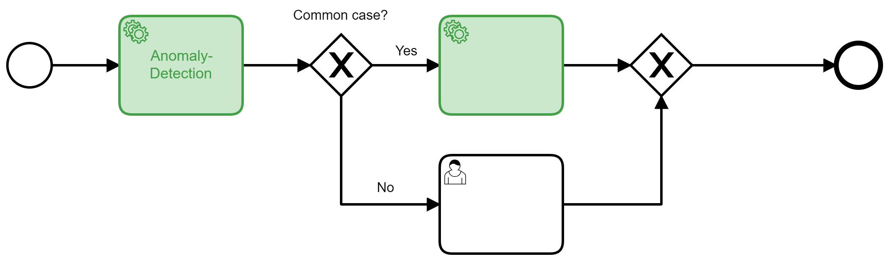

# bpmn.ai: Process Patterns to Orchestrate your AI Services in Business Processes

The journey through an AI project often only begins with a successful proof of concept. There is still little consensus regarding the orchestration of AI services. Tool support and methodological discussions often culminate with the provision of machine learning pipelines (e.g. through [Kubeflow](https://www.kubeflow.org/)) and web services in the cloud. 
From an architectural perspective, it is straightforward how to make a single machine learning model usable. But, how to integrate and combine them into business processes in a meaningful way?

Companies that already use a workflow engine (such as [Camunda](https://camunda.com) have a head start on AI use cases. There are different integration patterns, with their own advantages and disadvantages. The patterns can be easily understood as small BPMN processes. This is an important perspective to meet the demands of fairness and transparency in AI applications.

- [bpmn.ai: Process Patterns to Orchestrate your AI Services in Business Processes](#bpmnai-process-patterns-to-orchestrate-your-ai-services-in-business-processes)
  - [Group 1: Getting started](#group-1-getting-started)
    - [Process data collection - just look, do not touch](#process-data-collection---just-look-do-not-touch)
    - [Serviceless AI - DMN as minimal AI Runtime Environment](#serviceless-ai---dmn-as-minimal-ai-runtime-environment)
    - [Digital Common Sense - Anomaly Detection on Process Results](#digital-common-sense---anomaly-detection-on-process-results)
  - [Group 2: Intervenability](#group-2-intervenability)
    - [Controllable Degree of Automation](#controllable-degree-of-automation)
    - [Decision Support - AI First](#decision-support---ai-first)
  - [Gruppe 3: Datenschutz](#gruppe-3-datenschutz)
    - [GDPR Consent](#gdpr-consent)
    - [Entscheidung argumentieren](#entscheidung-argumentieren)
  - [Gruppe 4: Nachhaltigkeit](#gruppe-4-nachhaltigkeit)
    - [Drift Detection](#drift-detection)
  - [Gruppe 5: Multi-Model](#gruppe-5-multi-model)
    - [Routine automatisieren - aus Chancen lernen](#routine-automatisieren---aus-chancen-lernen)
    - [Ensemble](#ensemble)
    - [Divide and Conquer - Prozess-Zuordnung](#divide-and-conquer---prozess-zuordnung)
  - [Fazit](#fazit)

*Convention*: AI components are highlighted in green in the process patterns.

## Group 1: Getting started
### Process data collection - just look, do not touch

The first and simplest pattern contains no AI component, but only a business process with a manual activity, whose call is logged with the relevant metadata and process variables included.

This pattern already contributes to the implementation of an AI strategy: Since it brings a manual activity under process control, it allows you to derive insights from the process engine logs, that are highly useful to guide your AI projects in the future.

* How often is this activity performed?
* How large is its share of the runtime of the overall business process?
* How expensive are which activities?
* Are there systematic correlations between input and output of individual activities? May we hope to automate them?

Not only can you use insights such as these to prioritize automisation efforts, you will also need to rely on them while implementing automated decisions with machine learning approaches: They become part of the *loss function*.

An example of this: In input management an AI classifies incoming business transactions and forwards them to the responsible processes. The machine learning for this will learn on the history of manual classifications and try to classify them in the same way. Every machine learning needs a target key metric, which has to be optimized. The classic approach for classification problems of this kind is to optimize a kind of hit rate of correct to incorrect classifications. Although this works, it systematically wastes savings potential - in the end, the goal is incompletely defined. If we want to try to avoid expensive processes, this goal must become part of the target key metric, because in input management not all misclassifications are equally expensive.

* To wrongly categorize an incoming new customer contract as termination is the biggest possible mistake.
* Classifying a termination as an incoming new customer contract is a pity, but has hardly any economic consequences.
* If the economic consequences of mistakes are difficult to estimate, one can at least try to prefer favorable (or favorably correctable) processes.

The classic approach "maximize hit rate" implies that all errors have the same consequences. This is sufficient for a proof-of-concept, but not for productive, economic use of the AI components. To be able to make these weightings, a process data collection is needed as a basis.

:bulb: Especially external, outsourced tasks deserve this kind of attention.

:warning: Avoid storing personal data in process variables, in order to comply with GDPR goals.

### Serviceless AI - DMN as minimal AI Runtime Environment

Deep learning is modern and inspires with its possibilities, but it is the current ultimate ratio of machine learning: costly, data-hungry, difficult to understand, non-deterministic and they imply an increase in complexity in IT operations: You will need to maintain a number of fast moving infrastucture technologies, probably both software and GPU-ressources.

However, simplicity, explainability and determinism are obvious design goals - according to Commen Sense and also explicitly on the part of regulators such as the [Recommendations of the German Data Protection Conference (in german)](https://www.datenschutzkonferenz-online.de/media/en/20191106_positionspapier_kuenstliche_intelligenz.pdf) since 2019. For decision automation purposes, that rely on tabular data, there may be a shortcut route.

One way to maximize simplicity would be to use a rule-based or decision-tree based approach instead. Often, their results can be translated into _DMN decision tables_ with little frictional loss. DMN tables are not only traceable, but can also be modified as needed. In addition, there is no need for specific operational infrastructure: Modern worflow engines can execute DMN out of the box. This pattern highly attractive from an architecture point of view and in order to collect low-hanging fruits in terms of business cases - it will not serve as lighthouse project and will probably not win the enthusiasm of data scientists.

:bulb: In principle, this is also possible with more complex machine learning methods (e.g. through the [Anchors](https://github.com/viadee/javaAnchorExplainer) approach to derive rules from ML models). 

:warning: However, more precision will be lost in more complex cases in exchange for transparency and changeability. Also, there is an upper limit on what you can claim to be simple and explainable, be it in neural networks or large DMN tables. 

### Digital Common Sense - Anomaly Detection on Process Results

If the dark processing rate is high, whether with or without AI technologies, a control problem arises: There is a lack of common sense to check the result of the process, such as a calculated tariff or a contract, again and to check it for plausibility. In general, this should not be necessary, but errors always occur and if possible the customer should not be the first in the process to notice an error.

To address this issue, an AI procedure of anomaly detection can be used as one of the last process steps and in individual cases automatically trigger an escalation event - a manual check is requested.

The AI does not make its own technical decision here, but it can stop technical decisions of others (people and systems) if they look "strange". The introduction is therefore easier to argue but may offer fewer savings than optimizations. The keynote of anomaly detection is that an AI model learns what constitutes - or even violates - normality in a business process or its results. This can be based on obvious things like tariffs or costs, but it can also include more factors than would be manageable with manual testing. Optionally, aspects of the course of the process could also become part of the anomaly detection, for example to automatically escalate processes that are particularly long-running or (compared to the learned normality) circulated processes that are particularly frequent.

:warning: Attention: Expect false alarms. This pattern assumes that normality has been established in your process. For some business processes this assumption can be wrong.

* Very new processes with less than a few hundred process instances will not have produced enough data to allow the algorithm an adequate view of what _usually happens_.
* If this amount of data is gathered, the algorithm can point out _unusual_ data points and bring them to attention. This will also regularly happen after software releases, whenever they influece the data flowing through your processes. E.g. if you change your pricing scheme in a software release the first prices generated will likely look _unusual_ to the algorithm, until it is retrained on the new data points and we gathered enough of them, to consider them a part of the new normality.

## Group 2: Intervenability

### Controllable Degree of Automation

The use of process engines is an investment in flexibility - changes can be made in a coordinated manner without the need for complex release processes. In this way, an XOR gateway can be used to control automation levels.

Consider an AI component for a classification decision such as _"Does this insurance claim have to be examined by an expert?"_. Besides the decision itself, the AI component indicates how confident it is with its own decision (Confidence). This is usually given in the value range 0.0 to 1.0, where 1.0 corresponds to a 100% certainty, which is hardly achievable. 
Depending on this confidence value, we branch off to a manual processing or bypass it as needed:

* Minimum confidence = 100% - this would be equivalent to a test or pilot operation. The AI component operates live on the real data, but will in fact never make a decision autonomously because the 100% threshold is never reached. Even human clerks would have a residual uncertainty, but do not quantify it.
* Minimum confidence = ~93.45% - The AI decides if it can do it safely and smuggles standard cases past the clerk because for standard cases high confidence will be possible. The concrete threshold value can be optimized with regard to process and error costs, so that threshold values with several decimal places may be useful.
* Minimum confidence = 90.00% - A manually set value, based on the experience of those responsible for the process. The value is below the above-mentioned optimum. This increases the automation rate, we accept a higher error rate. This could be a useful configuration after a major incident, where the department is simply overwhelmed.
* Minimum confidence = 0.00% - The AI always decides autonomously, even if uncertainties are clear. In general, this is not a reasonable configuration, unless a business process is to be operated without employees (e.g. in a lockdown situation). Objection!

:warning: Note group 1: process data collection - automated decisions should be saved for later review, esp. if they have been overruled by manual decisions.

### Decision Support - AI First

Process design with a focus on Intervenability is the decision support where a machine learning component is always called before a human decision. It then passes on its results (including confidence estimation) as support for the manual decision. This is particularly useful when an additional method of explainable AI (XAI) is used, which can generate so-called local (i.e. case-related) explanations.

:warning: These kinds of systems make, despite their invincibility and the supposed focus on human decision making and ethical consideration necessary. Clerks will have to justify in case of doubt for deviations from the "AI specification". This creates an incentive not to do so, for example in the Austrian AMS decision model. From an ethical point of view, this would make the model degenerate to a fully automatic one (including the quality requirements to be met), as long as it is not organizationally ensured that the human decision will be made independently.

In the best case, a human-machine-four-eyes principle is created that improves the overall level of decision quality and consistency across several decision-makers and thus promotes fairness in the sense of equal treatment.

:warning: For this to succeed, equal treatment in the learning data set is a mandatory prerequisite. Also, the Austrian AMS can serve as a negative example, as it only reflects the prejudices of the labor market.

## Gruppe 3: Datenschutz

### GDPR Consent

According to GPDR Art. 22 (Lawfulness of automated processing) para. 1 there is a right of opposition or consent of individuals may be necessary to process their data for specific purposes - among other reasons for the lawfulness of processing, this should be the normal case.

The application of machine learning models would certainly be considered as _use_, and the inclusion of one's data in the training data stock would certainly be _use_ too. If a customer objects to this use, a "plan B" in the business process is needed, for which ML Serving tools often do not feel responsible.

:bulb: This can be implemented at the processor orchestration level of the IT architecture in a similar way to how VIP business transactions are handled in service companies, for example.

### Entscheidung argumentieren

Neben dem Einspruch ist eine nachträgliche Anfechtung denkbar - historische Entscheidungen werden hinterfragt und ggf. revidiert. Hierdurch ergibt sich die Pflicht automatisierte Entscheidungen nachträglich nachzuvollziehen und korrigieren zu können.

Das Machine-Learning-Modell historisiert die Falldaten inkl. Entscheidung und der ML-Modell Version. Diese Informationen sind notwendig, um einzelne Entscheidungen nachträglich am Modell zu wiederholen und systematisch zu analysieren. Wird ein Fall hinterfragt, dann liefert eine XAI-Analyse durch die Wiederholung dieses und potenziell vergleichbarer Fälle die Entscheidungswege, welche zum Ergebnis geführt haben. Der Einzelfall ist begründet und kann diskutiert und ggf. revidiert werden. Falsche Entscheidungswege werden transparent.

Über die ohnehin zu erwartende Protokollierung durch eine Prozess-Engine hinaus gilt: Revidierte Entscheidungen sind ein wichtiges Merkmal in den Daten. Der Datensatz wird korrigiert und als revidiert und korrigiert gekennzeichnet - um Fehler im ML Modell zu  verstehen und zukünftig zu minimieren.

:warning: Sobald personenbezogene Daten im Sinne der DSGVO im ML-Modell verarbeitet werden, ist dieses Muster verpflichtend (Vgl. Art 22 Abs. 3 DSGVO).

## Gruppe 4: Nachhaltigkeit

### Drift Detection
Most AI applications do not learn continously (and rightly so). This, however, raises the question: _"How often do I need to train my ML model with new data?"_

Drift (or Concept Drift) is a technical term that describes the fact that data becomes stale after some time. ML models derived from data therefore also become stale: The  knowledge baked into the model and reality drift apart. The following patterns helps to measure this effect.

Clerks are randomly assigned cases here with a certain probability. This non-automation rate is freely selectable, but should generally not be 0%, so that fresh training data is available in the future. An example: A company that has recorded market or customer behavior over a long period of time and used it for ML based marketing automation must fear, that the data from before the corona pandemic is no longer meaningful - the model has experienced a (sudden) concept drift.

Um diese in weniger offensichtlichen Fällen zu bemerken werden sporadisch manuelle Entscheidungen benötigt, die mit den KI-Entscheidungen verglichen werden.
Oft ändern sich nur Teile des Marktverhaltens - kleine Dinge wie bspw. neue Automarken machen es einem Machine Learning Model schwer aus der Vergangenheit zu lernen. Auch hier hilft eine kontinuierliche Versorgung mit aktuellen, manuellen Entscheidungen. 

:bulb: Das Muster kann auch für einen Pilotbetrieb / Riskless Rollout verwendet werden, wenn der Automatisierungsgrad nahe 0% justiert. Wichtig ist noch, jeweils zu protokollieren, ob eine manuelle oder automatische Entscheidung getroffen wurde, um Auditierbarkeit sicherzustellen und zu verhindern, dass das Modell sich an eigenen unverifizierten Entscheidungen orientiert.

## Gruppe 5: Multi-Model

### Routine automatisieren - aus Chancen lernen

Machine Learning trifft Fehlentscheidungen, wie Menschen auch. Geringe Trainingsdaten für seltene oder Sonderfälle sind hierfür hauptverantwortlich. Durch Kombination verschiedener ML Verfahren begegnen wir diesem Risiko, indem Seltenheiten - Anomalien - identifiziert und zur Sachbearbeiter:in gesteuert werden.

Eine Anomalieerkennung bewertet jeden Fall zuerst mit einem Anomalie-Score. Beispielsweise sollte der erste KFZ-Schaden eines neuen E-PKW Modells manuell bewertet werden, u.a. um daraus zu lernen.

* Niedrige Anomalie-Scores sollten die Regel darstellen. Diese Routinen sind ausreichend in den Trainingsdaten vorhanden und können mit hoher Konfidenz vom ML-Modell entscheiden werden.  
* Mittlere Anomalie-Scores sind selten. Prozessverantwortliche kontrollieren einen, der Konfidenz äquivalenten, Schwellwert. Wird dieser überschritten handelt es sich um eine Anomalie, die menschliche Aufmerksamkeit benötigt. Auf diese Weise werden nützliche Trainingsdaten erzeugt.
* Hohe Anomalie-Scores - Anomalien - werden grundsätzlich von einer manuellen Sachbearbeitung übernommen. Hier besteht dauerhaft wenig Hoffnung auf Automatisierung, aber die Aufmerksamkeit ist hier auch gut investiert. 

Anomalieerkennung begegnet dem Risiko unbekannte Fälle durch die Automatisierung “rutschen” zu lassen. Zwar sollte eine ML-basierte Klassifizierung Anomalien mit niedriger Konfidenz bewerten, jedoch sind Anomalie-Scores und Konfidenzwerte unterschiedliche Anwendungsfälle.

Anomalien könnte Sonderfälle identifizieren, welche wohlmöglich Chancen auf Prozessverbesserung bieten. Mindestens aber lernen zukünftige Modelle durch das gezielte Erzeugen neuer Lerndaten sicherer mit diesen Fällen umzugehen.

:bulb: Machine Learning-Modelle, die für Dritte zugänglich sind, müssen sich ggf. auch gegen gezielte Angriffe schützen, die ein Modell gezielt in die Irre führen sollen (Adversarial Machine Learning). Der Aufbau hierzu ist identisch.

### Ensemble

Verschiedene Verfahren des Machine-Learning haben auch unterschiedliche Stärken und Schwäche. Zwei Beispiele dazu:

* Entscheidungsbäume sind bspw. einfach nachzuvollziehen - das Overfitting-problem ist gut beherrschbar, komplexe Zusammenhänge in der jeweiligen Domäne bleiben dagegen unbeachtet.
* Deep Learning ist schlecht nachzuvollziehen, lernt allerdings Zusammenhänge in tieferer Komplexität.

Die Ensemble-Idee ist die Stärken von mehreren Verfahren zu kombinieren: Mehrere Modelle entscheiden den gleichen Fall - herrscht Einigkeit ist die Entscheidung klar. Uneinigkeit wird beobachtet und ebenfalls mit Machine-Learning-Mitteln überwacht - ein weiteres Modell entscheidet, welche Modelle in welchen Situationen gute Performance zeigen. 

Alternativ kann hier auch demokratisch entschieden werden, ggf. auch mit menschlicher Beteiligung im Sinne eines 4-Augen-Prinzips. Oft werden Ensembles auch “verpackt” eingesetzt, d.h. so, dass sie aus der aufrufenden Architektur-Schicht als ein einziges Modell agieren. Ein Nachteil ist, dass Stärken und Schwächen der Teil-Modelle nach außen hin unsichtbar und damit auch unreflektierbar bleiben. Mit einer expliziten Modellierung wird auch ein schrittweiser Rollout neuer Modelle möglich: Neue “Mitbürger” kommen mit in die Demokratie und stimmen mit ab, geben vielleicht gute Konfidenzwerte an und bekommen so viel Entscheidungs-Gewicht - oder nicht.

:warning: Lauf- und Lernzeiten steigen an, Feature-Wichtigkeiten sind schwerer abzuleiten.

### Divide and Conquer - Prozess-Zuordnung

Oft gilt es nicht nur einen Prozess zu automatisieren, sondern mehrere. Oft können Prozesse über mehrere Eingangskanäle durch Geschäftsvorfälle ausgelöst werden. Hier greift das Divide-and-Conquer Prinzip mit mehreren ML-Modellen, die Teile einer Problemstellung lösen.

Ein erster Verarbeitungsschritt extrahiert aus den eingehenden Dokumenten, E-Mails oder bspw. Chat-Nachrichten alle Entitäten, d.h. alle identifizierbaren Aspekte, wie sie in der Sachbearbeitung vielleicht in ein Formular eingetragen würden: Kunden-Namen, Mail-Adressen, Rechnungsnummern, etc. oder auch abstraktere Einschätzungen wie bspw. eine Sentiment-Analyse um die ausgedrückte Stimmung zu erfassen.

Auf diese Weise entstehen aus einem Strom eher schwach strukturierter Daten einer mit einzelnen bekannten Feldern. Diese lassen sich in einem zweiten ML-Schritt zur Klassifikation des am besten geeigneten Folgeprozesses nutzen, der die Daten verarbeiten kann.

Die Auftrennung dieser beiden Schritte ist strategisch sinnvoll, denn die Entity Extraction entwickelt sich zu einem Standard-Produkt, für das vortrainierte Modelle oder Cloud-Services eingesetzt werden können. Für die Prozessklassifikation braucht es eigene Lerndaten zu den eigenen Prozessen.

:warning: Es kann Vorfälle geben, die in keinen Prozess gehören oder mehrere Anliegen enthalten.

:warning: Die für das Machine Learning verwendete Zielmetrik sollte nicht nur auf die “Trefferquote” optimieren, sondern individuelle Fehlerkosten berücksichtigen. Eine Falschklassifikation als Kündigung kann teuer werden.

## Fazit

Künstliche Intelligenz unterstützt viele Herausforderungen moderner Prozessautomatisierung. Allein die Prozesskennzahl-Sammlung verbessert die Datenlage und gibt Auskunft über das Verhalten einzelner Teilprozesse. Prozessverantwortliche steuern per Konfidenzen den Automatisierungsgrad und behalten die Kontrolle über die Maschine. 

Eine gesunde Skepsis gegenüber KI-Integration wird begründetem Vertrauen weichen, wenn die Risiken durch Erklärbarkeit, Drift Detection und Anomalieerkennung adäquat adressiert werden. Unabhängig von den verwendeten Pattern bzw. der Art der KI Integration muss es eine Historisierung der KI Ergebnisse und der verwendeten Modelle geben, um sowohl den Datenschutz als auch die Qualität der künstlichen Intelligenz zu verargumentieren.
