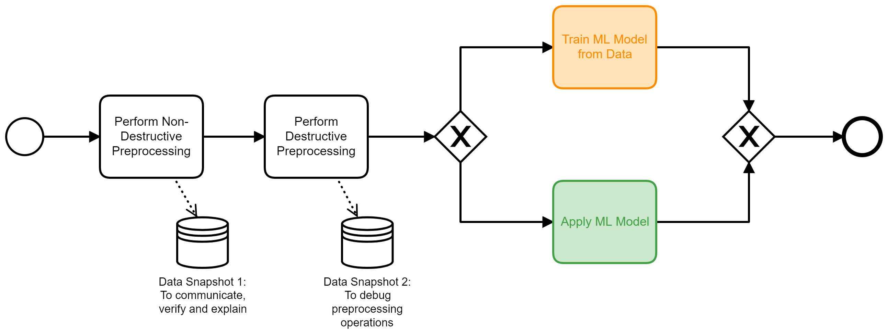

## Group 5: Training

Here, we are switching into a different phase of a machine learning project: The phase of data preparation and learning. A process perspective is essential here as well.

### Pipelines and DAGs

Training and preprocessing happens in DAGs. This is a best practice. It will be useful to investigate and explain useful pipeline patterns here.

### Increasing Levels of Destruction

Data preprocessing is crucial in any machine learning project after the initial experimental phase and often even then. Most of the data scientist's time investment will be spent here. It is reasonable to assume a considerable number of preprocessing steps that build each other.
Without further criteria, those preprocessing steps will be performed in order of their creation: any conceptual idea and any fix for a newly found data quality problem is regularly appended at the end of the chain. While this represents the chain of thought of the data scientist it effectively _breaks_ the explainability of the resulting ML model.

Some operations typically found in data preparation scripts are more destructive than others.
Consider the case of missing value imputation: Many ML models can not use incomplete datasets at all. One way to approach this problem is by filling in the gaps, for example with a reasonable average value, i.e. a mean age of all loan applicants. Eventually, we will need to justify our model's decision for an individual case using explainable AI models. For the loan application case any explanation using an artificial age is _inacceptable_. Using imputed values may be beneficial for the overall model, but it never is for an explanation of individual cases: I don't want to be judged by an age, I never provided.

On the other hand, operations such as deriving an applicants age in years from his/her birthday to a number format is a perfectly reasonable transformation for a dataset to be used in explanations. Here, no information is lost or assumed. You could even argue, that transormations of this kind make resulting interpretations easier to digest.

With these two examples, we can derive the following recommended ordering for data proprocessing operations:

1. Order your preprocessing operations from non-destructive (bijective) operations to destructive operations.
2. Store a copy of your dataset, after all non-destructive operations are performed. This is your communicatable dataset, that external stakeholders can either understand, verify or mutate (in a sensitivity analysis). It must pass integrity expectations like: "_This is exactly the data you received._"
3. Store a copy of your dataset, after all preprocessing operations have been performed. This is your debugging-dataset. It documents what changes the preprocessing operations made and hence, what the machine learning algorithm received.

Typical non-destructive preprocessing operations are for example:

- Changing the data type without loss of information (string to category/number), integer to float)
- Data cleansing in the form of removing data instances or features without information content, with many corrupt, missing or invalid values
- Constructing new features from existing ones, such as age from a date of birth

Typical destructive preprocessing operations are:
- Change of data type with loss of information (float to int)
- Aggregation of values to bins (numeric) or category ("light blue" and "navy blue" to "blue")
- Replace missing values
- Replace feature(s) with constructed feature(s), e.g. through dimensionality reduction algorithms such as a PCA.

Although standardization and normalization of numerical values are non-destructive too (in case the scaler is saved), it is better to apply these operations as a last step in order to keep the data human understandable.

### Human in the Loop

This is a particular form of machine learning that needs more explanation and a process perspective.